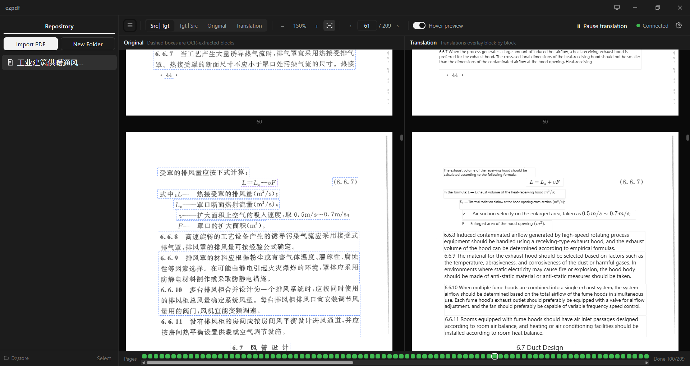

# ezpdf

[简体中文](README.md) | English

[](https://github.com/DriftThe/ezpdf/releases)
[](LICENSE)

**A real-time PDF translation reader**: the original text on the left, per-block translations laid over it on the right, translated as you read.

ezpdf first splits every page into content blocks with coordinates via OCR, translates each block with an LLM, and then draws the translation back onto the exact position of the original as an overlay. Terminology, formulas and footers are covered; tables, images and charts keep their original pixels and are never destructively redrawn.



## Features

- **Side-by-side view**: original and translation panes stay in sync by page; hovering a block in the original pane previews its translation.
- **Structure preserved**: overlay rendering driven by layout analysis — nothing is reflowed or redrawn, so the original layout stays intact.
- **Incremental processing**: pages are queued and processed as an OCR → translate pipeline, so finished pages appear immediately instead of waiting for the whole book.
- **Formula rendering**: `formula` blocks are rendered with KaTeX, with the font size fitted to the overlay box.
- **Redrawn tables**: with the `table` type checked, tables (merged cells included) are redrawn as web tables in the translation pane, with KaTeX for formulas inside cells; tables whose structure cannot be parsed are left untouched.
- **Smart context**: the translation flow embeds a hidden loop that lets the model request surrounding PDF context, keeping terminology and pronouns consistent across page breaks.
- **Local OCR service**: an embedded Python service (layout analysis + text recognition) with a one-click in-app installer, supporting CPU and GPU (CUDA).
- **Provider presets**: ships a vendored pi-ai model catalog (31 providers / 969 models) that fills in endpoint, protocol and parameter shape from the chosen provider; any OpenAI-compatible endpoint also works.
- **Book repository**: any plain folder is a repository holding PDFs plus an `.ezrepo` index; folders, moving, deleting and multi-file import are supported, and a book's parse state can be cleared in one click to parse it again.
- **Controllable scope**: pick which block types are translated (text, titles, footnotes, footers, tables, …) under Settings → General. Unchecked types are neither translated nor covered — the original PDF pixels stay. Changes apply only to blocks that are not translated yet (exception: once `table` is checked, tables that were never translated inside already-translated pages get translated on their own).
- **Self-drawn interface**: no system title bar — chrome and window controls are drawn by the app; light, dark and follow-system themes.

## How it works

```
PDF ──pdfjs──▶ page rendering (self-drawn virtual scroll)
  │
  └─▶ page image ──▶ local OCR service ──▶ content blocks + coordinates (bound JSON)
                                            │
                                            └──▶ LLM translation ──▶ translation overlays
```

- **Frontend**: Vue 3 + TypeScript + Vite with Pinia for state. Both panes are drawn by `pdfjs-dist` (no pdf-vue3-style viewer).
- **Backend**: Rust (Tauri 2) handles the repository index, file locks, translation scheduling and the OpenAI-compatible client. PDF binaries never travel through IPC — the frontend reads them directly over the asset protocol.
- **OCR service**: `pyserver/` (Python + FastAPI) runs a single-instance pipeline — **PP-DocLayoutV3** for layout analysis and **PaddleOCR-VL-1.6** for recognition. Models are downloaded on first use.
- **Parse state**: each book has one JSON file (`{status, pages[{index, finished, translated, blocks[]}]}`), which is the single source of truth and can be edited by hand.

## Download and install

Get the packages from [Releases](https://github.com/DriftThe/ezpdf/releases):

| Platform | Artifact |
| --- | --- |
| Windows | `ezpdf_<version>_x64-setup.exe` (NSIS installer) |
| Debian / Ubuntu | `ezpdf_<version>_amd64.deb` |
| Fedora / RHEL | `ezpdf-<version>-1.x86_64.rpm` |

> The installers are not code-signed yet, so Windows shows a SmartScreen prompt on first run. See the roadmap below.

## Getting started

### Use the app

Install and launch `ezpdf`; the first-run walkthrough is in "First run" below.

### Run from source

Prerequisites: Node 20+ and **pnpm**, Rust stable, plus the Tauri 2 build dependencies for your platform (WebView2 on Windows; `libwebkit2gtk-4.1-dev libgtk-3-dev librsvg2-dev patchelf libayatana-appindicator3-dev` on Linux).

```bash
pnpm install
pnpm tauri dev      # desktop app (starts Vite automatically)
```

Useful commands:

| Command | Purpose |
| --- | --- |
| `pnpm tauri dev` | Desktop development mode (restart after Rust changes) |
| `pnpm dev` | Frontend only (opens in a browser; without a Tauri runtime OCR and translation stay idle) |
| `pnpm build` | Type check (`vue-tsc --noEmit`) plus frontend build — this is the repo's typecheck command |
| `pnpm tauri build` | Build installers (NSIS on Windows; add `--bundles deb,rpm` on Linux) |
| `cd src-tauri && cargo check` / `cargo test` | Rust checks and tests (`cargo test` also regenerates the ts-rs bindings) |
| `node scripts/sync-pi-models.mjs` | Refresh the vendored pi-ai model catalog (`--latest` to follow the newest release) |

## First run

1. **Create a repository**: click **Select** in the left sidebar and pick a folder (any empty folder works), or reopen a repository you created earlier.
2. **Import PDFs**: click **Import PDF** and choose files (multiple selection supported). PDFs are copied into the repository and a skeleton JSON is generated next to each one.
3. **Configure a translation model**: open Settings → **LLM**, choose a **provider** and a **preset model** (or type a model name), enter your **API key**, then click **Verify** to confirm connectivity. The OpenAI-compatible protocol is used by default. If you do not need translation yet, turn off **Enable translation** (the first switch on that page): OCR text is then written into the translation field as-is and marked done, and re-enabling translation later will not re-translate those pages.
4. **Get an OCR service ready**: open Settings → **OCR** and pick a **service source**.
   - **Managed locally** (default): click **Install service** to install the Python dependencies (including torch) and download the models (~1.9 GB; a China-mainland mirror is available). Once all five status lights are green the service is ready; pick CUDA if you have an NVIDIA GPU.
   - **Online service**: enter the address of a deployed instance of the same parse service (e.g. `http://127.0.0.1:9055`) and click **Test** to probe it — no local dependencies or models needed, and the batch size is whatever that service advertises (re-negotiated before every request). If the server requires auth (deployed instances do by default), paste the token it printed on startup into **Service token**. See [`pyserver/PROTOCOL.md`](pyserver/PROTOCOL.md) for the full contract to build your own server, run `python pyserver/server_test.py` (port 9055) for development, or use the container images below.
5. **Start translating**: the toolbar shows **Start translation** because the app boots paused to save power. Click it once to begin, or enable **Wake the OCR service on launch** and **Resume on launch** under Settings → General for automatic operation.
6. **Read**: click a book in the sidebar to open the two-pane reader. The toolbar switches between four layouts (original│translation, translation│original, original only, translation only) and controls zoom and paging; the status bar at the bottom shows overall progress.

> **Do not modify the contents of a repository by hand** — it can break both parsing and rendering.

> **Changing the target language or the translated block types does not re-translate pages that are already done.** Use **Clear parse state** in that book's row menu to drop its blocks and translations and parse it again.

### Where data lives

| Item | Location |
| --- | --- |
| App settings (including the API key) | Windows: `config.json` in the install directory; Linux / macOS: `~/.ezpdf/config.json` |
| PDFs and parse JSON | Inside the repository folder you chose |
| Bundled Python environment / models | Linux: `~/.ezpdf/venv`, `~/.ezpdf/models`; Windows: `python/` in the install directory and `~/.ezpdf/models` |

> The API key is stored in `config.json` in plain text — mind the file permissions.

### Running the parse service with Docker (optional)

If you would rather not install the Python dependencies and models on your machine, run just the parse
service in a container and point the app at it via **Online service**:

```bash
cd pyserver
docker compose --profile cpu up -d --build     # CPU image (runs anywhere)
docker compose --profile gpu up -d --build     # GPU image (host needs a driver + nvidia-container-toolkit)
```

Behind a slow or blocked network, point all four sources at mirrors (same idea as the app's own mirror switch):

```bash
docker compose --profile cpu build \n  --build-arg BASE_IMAGE=docker.m.daocloud.io/library/python:3.12-slim \n  --build-arg APT_MIRROR=mirrors.tuna.tsinghua.edu.cn \n  --build-arg PIP_INDEX=https://pypi.tuna.tsinghua.edu.cn/simple \n  --build-arg TORCH_INDEX=https://mirror.sjtu.edu.cn/pytorch-wheels/cpu   # .../cu132 for GPU
docker compose --profile cpu up -d
```

The models (~1.9 GB) are baked straight into the image, so a container can infer as soon as it boots
without downloading anything. What the image actually contains (file sizes measured inside the container): about 3.6 GB for CPU and 7.3 GB for GPU, of which 1.9 GB models and 0.75 / 1.2 GB torch (the GPU one adds ~2.6 GB of CUDA runtime). `docker images` reports a larger number because of how it accounts for layers - trust the file sizes. Size is not a goal here - the image is a faithful package of the verified environment, and the baked-in models are deliberate: the container needs no volume and no network, so it boots straight into inference on an air-gapped or network-isolated server. The server **prints its access token on every start** — copy it into
Settings → OCR service → Service token (address: `http://127.0.0.1:9055`):

```bash
docker compose logs -f ezpdf-pyserver-cpu      # look for the "auth token: ..." line
```

> The build cache lives inside BuildKit - **never run `docker builder prune`**: clearing it makes the
> next build re-download several GB of torch wheels. The Dockerfile mounts apt and pip caches, so
> touching an upper layer does not re-download them.

The token is kept in the mounted volume at `pyserver/data/token.txt`, so restarts and container
rebuilds never invalidate what the client has saved. It listens on `127.0.0.1:9055` only by default;
change the port mapping in `docker-compose.yml` to expose it to a LAN or the internet, and remember
this protocol is plain HTTP with a bearer token — put it behind an HTTPS reverse proxy if it is
publicly reachable.

## Roadmap

- **Code signing**: the installers are unsigned. The plan is to apply for [SignPath Foundation](https://signpath.org/)'s free signing for open-source projects (certificate issued to SignPath Foundation, private key held in an HSM); a code signing policy statement will be added here once approved.
- **AppImage**: not provided yet. An AppImage mounts read-only from a random path, which invalidates the virtual environment derived from the bundled Python runtime; supporting it means copying the interpreter to a stable location (such as `~/.ezpdf/python`) before creating the venv.
- **Other protocols**: only OpenAI-compatible (`openai-completions`) endpoints can be called, so providers speaking other protocols are no longer listed in the provider dropdown (a saved config pointing at one shows as a disabled entry). See [`docs/protocols.md`](docs/protocols.md) for why, and what adding one would take.

## Contributing

Issues and pull requests are welcome.

1. Fork the repository and create a feature branch from `main`.
2. Make sure the following pass before submitting:
   ```bash
   pnpm build                      # typecheck + frontend build
   cd src-tauri && cargo test      # Rust tests + regenerate bindings
   ```
   There is no lint or unit-test script yet; those two commands are both the gate and the typecheck.
3. Use [Conventional Commits](https://www.conventionalcommits.org/) (`feat:` / `fix:` / `docs:` …) and explain **why** in the body.
4. Describe how to reproduce and verify your change in the PR (screenshots are welcome).

Conventions:

- **Do not edit generated files**: `src/lib/piModels.generated.ts`, `src-tauri/bindings/`, `src-tauri/gen/`.
- **Do not commit secrets**: `auth.cfg` and `config.json` are gitignored, and the build script checks the bundle for leaked keys.
- New Tauri plugin capabilities must be added to `src-tauri/capabilities/default.json`.
- Changing the prompt protocol requires keeping `src-tauri/src/translate.rs`'s parser in sync.
- UI strings live in `src/locales/` in three languages (简体中文 / 繁體中文 / English) — add new strings to all three.
- Architecture and module design are documented in `AGENTS.md` (Chinese).

## Acknowledgements

- **Baidu PaddlePaddle team**: ezpdf's OCR is built entirely on their open-source work — **PP-DocLayoutV3** for layout analysis and **PaddleOCR-VL-1.6** for text recognition. Thanks also to the **PaddleOCR / PaddleX** projects and their communities.
- **Mozilla pdf.js** (`pdfjs-dist`): the rendering foundation for both panes.
- **Tauri**, **Vue 3**, **Vite**, **Pinia**: application shell and interface.
- **KaTeX**: formula rendering.
- **vue-i18n**: UI localization.
- **pi-ai** (Mario Zechner): the vendored model and provider catalog.
- **python-build-standalone** (Gregory Szorc / Astral): the relocatable Python runtime shipped with the app.
- And every maintainer of the upstream dependencies.

> Released under the Apache-2.0 license (see [LICENSE](LICENSE)). The models downloaded on first use remain the property of their respective authors; follow their licenses when using them.
