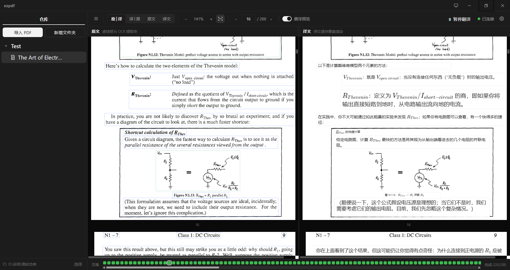

# ezpdf

简体中文 | [English](README.en.md)

[](https://github.com/DriftThe/ezpdf/releases)
[](LICENSE)

**实时 PDF 翻译阅读器**：左侧原文、右侧译文逐块覆盖，随读随译。

本应用先以 OCR 将 PDF 每页切分为带坐标的内容块，再由大模型逐块翻译，最后将译文以覆盖框精确盖回原文位置。术语、公式与页脚均会被覆盖；表格、图片与图表保留原始像素，不作破坏性重绘。



## 功能特性

- **双栏对照**：原文与译文左右并排、页码同步；悬停原文块可在译文侧预览对应译文。
- **结构保留**：依据版面（Layout）分析结果进行覆盖式渲染，不重排、不重绘，原文结构得以完整保留。
- **增量处理**：按页排队，OCR 与翻译构成流水线（OCR → Translate），已完成的页面即时可见，无需等待整本书。
- **公式渲染**：`formula` 块由 KaTeX 渲染，覆盖框内自动适配字号。
- **智能上下文**：翻译流程内置隐性循环，模型可按需申请调取 PDF 上下文信息以增强理解，保证跨页句子的术语与人称一致。
- **本地 OCR 服务**：内嵌 Python 服务（版面分析 + 文本识别），提供应用内「一键安装服务」，支持 CPU 与 GPU（CUDA）。
- **供应商预设**：内置 pi-ai 模型目录（31 家供应商 / 969 个模型），选定供应商即自动填充端点、协议与参数形态；同时支持任意 OpenAI 兼容端点。
- **书籍仓库**：任意普通文件夹即为一个仓库，存放 PDF 与 `.ezrepo` 索引；支持文件夹归类、移动、删除与多选导入。
- **自绘界面**：不启用系统标题栏，界面元素与窗口控件均由应用自绘；支持浅色、深色与跟随系统三种主题。

## 工作原理

```
PDF ──pdfjs──▶ 页面渲染（自绘虚拟滚动）
  │
  └─▶ 取页图 ──▶ 本地 OCR 服务 ──▶ 内容块 + 坐标（bound JSON）
                                   │
                                   └──▶ LLM 翻译 ──▶ 译文覆盖框
```

- **前端**：Vue 3 + TypeScript + Vite，状态由 Pinia 管理；左右两栏均基于 `pdfjs-dist` 自绘（未使用 pdf-vue3 一类查看器）。
- **后端**：Rust（Tauri 2）。负责仓库索引、文件锁、翻译调度与 OpenAI 兼容客户端；PDF 二进制不经 IPC 传输，前端通过 asset 协议直接读取。
- **OCR 服务**：仓内 `pyserver/`（Python + FastAPI）为单实例流水线，版面分析使用 **PP-DocLayoutV3**，文本识别使用 **PaddleOCR-VL-1.6**，模型于首次使用时下载。
- **解析状态**：每本书对应一份 JSON（`{status, pages[{index, finished, translated, blocks[]}]}`），它是唯一真相源，且可由用户直接编辑。

## 下载安装

请前往 [Releases](https://github.com/DriftThe/ezpdf/releases) 下载：

| 平台 | 产物 |
| --- | --- |
| Windows | `ezpdf_<version>_x64-setup.exe`（NSIS 安装包） |
| Debian / Ubuntu | `ezpdf_<version>_amd64.deb` |
| Fedora / RHEL | `ezpdf-<version>-1.x86_64.rpm` |

> 安装包目前尚未进行代码签名，Windows 首次运行时会出现 SmartScreen 提示。签名计划见「路线图」。

## 启动方法

### 直接使用

安装后启动 `ezpdf`，首次运行的引导见下节「初次使用」。

### 从源码运行

前置条件：Node 20+ 与 **pnpm**、Rust stable，以及对应平台的 Tauri 2 构建依赖（Windows 需 WebView2；Linux 需 `libwebkit2gtk-4.1-dev libgtk-3-dev librsvg2-dev patchelf libayatana-appindicator3-dev`）。

```bash
pnpm install
pnpm tauri dev      # 桌面应用（会自动启动 Vite）
```

常用命令：

| 命令 | 作用 |
| --- | --- |
| `pnpm tauri dev` | 桌面应用开发模式（Rust 改动需重启） |
| `pnpm dev` | 仅运行前端（在浏览器中打开；无 Tauri 环境时 OCR 与翻译静默不工作） |
| `pnpm build` | 类型检查（`vue-tsc --noEmit`）与前端构建，同时作为本仓库的类型检查命令 |
| `pnpm tauri build` | 生成安装包（Windows 为 NSIS；Linux 追加 `--bundles deb,rpm`） |
| `cd src-tauri && cargo check` / `cargo test` | Rust 检查与测试（`cargo test` 会顺带重新生成 ts-rs 绑定） |
| `node scripts/sync-pi-models.mjs` | 刷新内置的 pi-ai 模型目录（`--latest` 跟随最新版本） |

## 初次使用

1. **新建仓库**：启动后点击左侧「选择」，指定一个文件夹作为仓库（任意空文件夹即可），也可选择已创建过的仓库。
2. **导入 PDF**：点击「导入 PDF」选择文件（支持多选）。PDF 将被复制进仓库，并生成同名的骨架 JSON。
3. **配置翻译模型**：进入 设置 → **LLM**，依次选择「供应商」与「预设模型」（亦可手动填写模型名），填入 **API Key**，并点击「验证」确认连通性。默认使用 OpenAI 兼容协议。
4. **安装 OCR 服务**：进入 设置 → **OCR**，点击「一键安装服务」。该过程将依次安装 Python 依赖（含 torch）并下载模型（约 1.9GB，可切换国内镜像源）。五个状态灯全部为绿即表示就绪；配备 NVIDIA 显卡时可选择 CUDA。
5. **开始翻译**：工具栏默认显示「启动翻译」（出于省电考虑，启动后为暂停状态）。点击一次即可开始；若希望启动后自动运行，可在 设置 → 常规 中开启「启动时自动唤醒 OCR 服务」与「启动时自动续跑」。
6. **阅读**：在左侧点选一本书即可进入双栏阅读。顶部可切换「原译 / 译原 / 原文 / 译文」四种布局、调整缩放与页码；底部显示整本书的处理进度。

> **请勿手动修改仓库中的内容物**，否则可能影响解析与渲染结果。

### 数据存放位置

| 内容 | 位置 |
| --- | --- |
| 应用设置（含 API Key） | Windows：安装目录中的 `config.json`；Linux / macOS：`~/.ezpdf/config.json` |
| PDF 与解析 JSON | 由你指定的仓库目录内 |
| 随包 Python 环境 / 模型 | Linux：`~/.ezpdf/venv`、`~/.ezpdf/models`；Windows：安装目录下的 `python/`、`~/.ezpdf/models` |

> API Key 以明文形式保存在 `config.json` 中，请注意该文件的访问权限。

## 路线图

- **代码签名**：安装包目前未签名。计划申请 [SignPath Foundation](https://signpath.org/) 面向开源项目的免费签名（证书由 SignPath Foundation 签发、私钥托管于 HSM），届时将在此处补充签名策略说明。
- **AppImage**：暂不提供。AppImage 以随机路径只读挂载，随包 Python 运行时派生的虚拟环境会因其绝对路径失效；需先将解释器复制至稳定目录（如 `~/.ezpdf/python`）再创建虚拟环境，此项在计划中。
- **其他协议**：当前仅支持 OpenAI 兼容协议（`openai-completions`）的端点；其余协议在供应商目录中仅可识别，尚不可调用。

## 贡献方法

欢迎提交 Issue 与 Pull Request。

1. Fork 本仓库，并从 `main` 创建特性分支。
2. 提交前请确保以下命令通过：
   ```bash
   pnpm build                      # 类型检查 + 前端构建
   cd src-tauri && cargo test      # Rust 测试 + 重新生成 bindings
   ```
   本仓库暂无 lint 与单元测试脚本，上述两条命令既是门禁，也是类型检查命令。
3. Commit message 遵循 [Conventional Commits](https://www.conventionalcommits.org/)（`feat:` / `fix:` / `docs:` 等），正文说明改动的**原因**。
4. 提交 PR 时请描述复现步骤与验证方式（附截图更佳）。

几点约定：

- **不要手改生成物**：`src/lib/piModels.generated.ts`、`src-tauri/bindings/`、`src-tauri/gen/`。
- **不要提交密钥**：`auth.cfg` 与 `config.json` 已列入 `.gitignore`，构建脚本亦会检查产物是否泄漏 Key。
- 新增 Tauri 插件能力时，需在 `src-tauri/capabilities/default.json` 中补充相应权限。
- 修改提示词协议时，需同步 `src-tauri/src/translate.rs` 的解析逻辑。
- 界面文案的三种语言（简体中文 / 繁體中文 / English）位于 `src/locales/`，新增文案请保持三语齐全。
- 仓库架构与各模块设计详见 `AGENTS.md`。

## 鸣谢

- **百度 PaddlePaddle 团队**：本项目的 OCR 完全建立在其开源成果之上——版面分析使用 **PP-DocLayoutV3**，文本识别使用 **PaddleOCR-VL-1.6**。同时感谢 **PaddleOCR / PaddleX** 项目及其社区。
- **Mozilla pdf.js**（`pdfjs-dist`）：左右两栏页面渲染的基础。
- **Tauri**、**Vue 3**、**Vite**、**Pinia**：应用外壳与界面。
- **KaTeX**：公式渲染。
- **vue-i18n**：界面多语言。
- **pi-ai**（Mario Zechner）：内置的模型与供应商目录数据。
- **python-build-standalone**（Gregory Szorc / Astral）：随包分发的可重定位 Python 运行时。
- 以及所有上游依赖的维护者。

> 代码以 Apache-2.0 许可发布（见 [LICENSE](LICENSE)）；随包下载的模型版权归各自作者所有，使用请遵守其许可协议。
